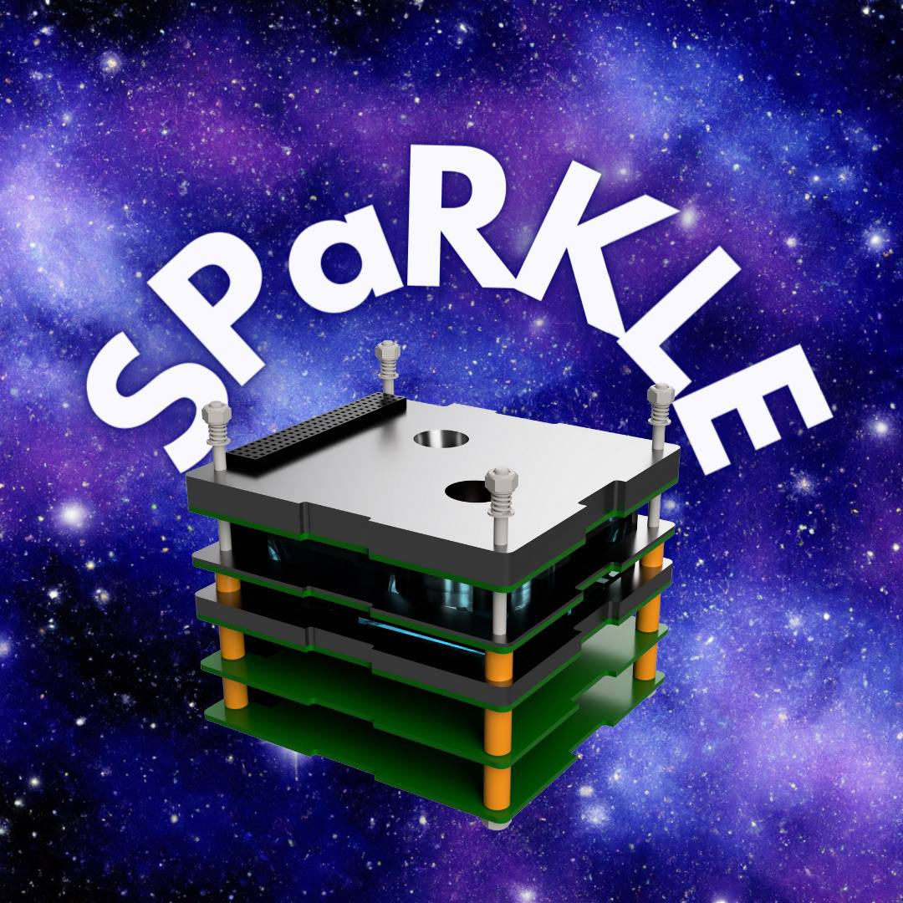
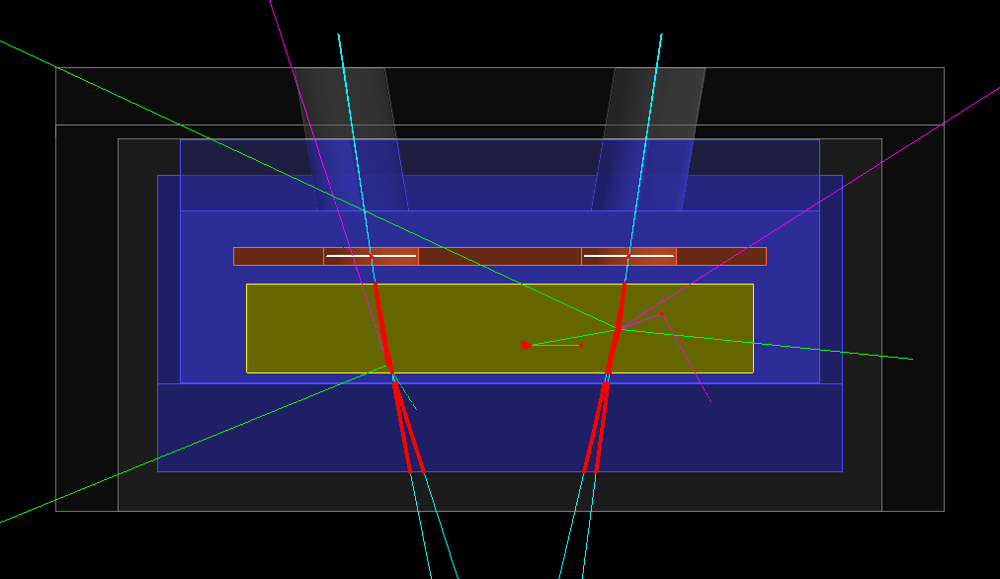

# SPaRKLE
## Readme da scrivere ancora



- For the official page of **Geant4 toolkit** visit [https://geant4.web.cern.ch/](https://geant4.web.cern.ch/)

------------------------------------

## The content of the software

In this simulation I am going to build the geometry of the Small Particle Recognition Kit for Low Energies (SPaRKLE) which is an instrument for the measurement of the fluxes of particles in the sub-MeV region for electrons, protons.

The calorimeter inside is able to detect photon in the keV-MeV region. This will allow the detection of Terrestrial Gamma Flashes (TGFs) and Gamma Ray Bursts (GRBs).




The detector is designed in the following way. From the external to the internal part there are:
- An aluminium mask formin a collimator. The Aluminium layer is 0.8 cm thick
- An active Veto made of plastic scintillator EJ-200 1 cm thick
- A first Silicon layer $100 \ \mu m$ thick. This is the $\Delta E$ layer in which only a small fraction of the energy is deposited. This amount of energy is sometimes called Linear Energy Transfer (LET). This because  
$$
\Delta E \approx \biggl| - \frac{1}{\rho} \frac{dE}{dx} \biggr| \rho_{Si} \times \Delta x
$$

- A calorimeter made of GAGG is used for the detection of the residual energy of the particle or the energy of the photon. The thickness of the GAGG layer is 1 cm.

- An active veto, made of plastic scintillator Ej-200 is then positioned on the back. If a particle is too energetic, it reaches the veto which wiull trigger ignoring that event.

The detector is based on the $\Delta E - E$ technique. This simulation is aimed at characterising the energy deposition inside the materials using the correct geometry of the instrument. 

This geometry has been implemented within the DetectorConstruction class.


-----------------------
## Brief description of the directory structure

This is a **CMake** project. Therefore, a CMake file is required. In this case, the file is named **CMakeLists.txt**. The subdirectory **build/** is needed to compile the project.

Files are divided into two cathegories:
- **src** : Sources file with the implementation of all the classes
- **include** : Classes declaration and all the libraries to be included in the project
- **macros** : Here there are all the macros used to generate the data for the simulation. To run these macros you need to start the simulation in batch mode
```
./Name_of_the_executable_file Name_of_the_macro.mac
```
- **ROOT_macros** : Here there are all the .root macros to process data and also used to generate all the plots. To propely run these macros you need to follow these steps:


## How to use the files in the simulation directory
1. Create the build folder
2. Build the project using cmake
3. Run the exacutable
  a. If you want to run the simulation in interactive you should run the executable without arguments
  b. If you want to run the simulation in batch mode you should add the macro as argument
4. Use the macros in the ROOT_macro directory to analyze data and create the plots


---------------------------------------


## Build the project
To build the project go to the /build directory and run the command

```
cmake ..
```

Then, you can run the command

```
make
```

Then, an executable file will be created in the /build directory. To run the executable file, simply run the command
```
./Name_of_the_executable_file
```
The name of the executable file, in this case, is simply "simulation", which is exactly the name of the project.

--------------------------------------------

## Useful resources 
- Physics Matters Geant4 tutorial : [Link](https://www.youtube.com/playlist?list=PLLybgCU6QCGWgzNYOV0SKen9vqg4KXeVL)
- Geant4 page : [Link](https://geant4.web.cern.ch/)
- Geant4 User guide : [Link](https://geant4.web.cern.ch/support/user_documentation)
- ROOT Cern C++ : [Link](https://root.cern/)
